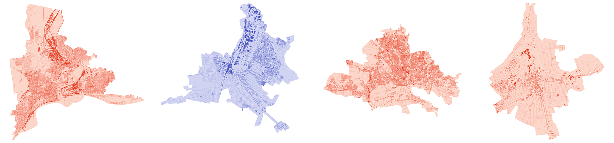

# Export all cities in the Donbas and create SVGs



## Introduction
For the NZZ article [The last bastions in the Donbas: Putin wants to conquer these cities before any peace agreement
](https://www.nzz.ch/english/the-cities-in-the-donbas-putin-wants-to-conquer-before-negotiating-peace-ld.1874228) we exported all the settlements in the Donbas from OpenStreetMap. These scripts do exactly that and generate an SVG graphic for each settlement. Each city is colored differently depending on whether and when the settlement was conquered.


## Installation
**Create VirtuelEnv**
```
# Mac
python3 -m venv env

# Windows
python -m venv env
```

**Start env**
```
# Mac
source env/bin/activate

# Windows
.\env\Script\activate
```

**Install Requirements**
```
pip install -r requirements.txt
```

## Usage
### [10-cities-export-geodata.ipynb](src/10-cities-export-geodata.ipynb)
This script does:
* Export all settlement areas from OSM and save them in [export/settlements.gpkg](export/settlements.gpkg)
* Export  *roads*, *train tracks* and *buildings* for each settlement area from OSM. These are stored in the [export/shapes](export/shapes) folder

### [20-cities-create-svg.ipynb](src/20-cities-create-svg.ipynb)
This script
Generates an SVG graphic for each settlement, which is stored in the [export/svg/](export/svg/) folder.

### License
These scripts may be used and edited freely. The original data belongs to OpenStreetMap and may be used in accordance with OpenStreetMap's license terms.

### Contact
[See here](https://www.nzz.ch/impressum/simon-huwiler-shu-ld.1650592)